# NestBite Readme

**NestBite** is a web based app built with Django, designed primarily as a booking system for restaurant tables. Its user friendly and intuitive design make it easy to interact and explore. To learn more about NestBite have a look at the README!

## Devices Mockups
### Laptop view

### Tablet and Mobile view
||||
|--|--|--|
||||

## Link to main page.

[NestBite Homepage](https://nestbite-5dd11ab0ac7f.herokuapp.com/)

## Readme content
1. About NestBite
2. User Stories / Agile workflow
3. UI/UX Design
4. Features
5. Project structure
  - Models
  - Views
  - Forms
  - Urls
  - Templates
  - Assets
6. Testing / Validation
7. Deployment
11. Technologies
12. Languages
13. Bugs and Fixes
14. Credits

## About NestBite
- NestBite is a web based app built with `Django`, is simulate a restaurant table reservation system.  
This project was created as 4th part of my portfolio building under the guidance and teaching of Code Institue.  
The choise for this project is made by the fact that I actually work in this enviroment and  
it was a fun idea to replicate my experience in an application built by me.
- The development for this project was much different from the previous projects made.  
With the introduction of Agile Workflow and many different aspects to integrate to the aquired knowledge,  
made the development of this project a great challenge and also a great achivement for my personal growth.

## User Stories
- As mentioned before the introduction of Agile made my routine differ from the past.  
I researched in advance what a person using this kind of application would like to be able to do, what they would look for in this enviroment.  
The kind of people that I question where from different backgrounds 
    - Collegues from hospitality.
    - Friends in university(Computer Science).
    - Real life customers.
    - People that are first time users.
    - Also I question myself to understand better what would be the optimal conclusion for all the answers that I received and how to proceed.
- My `user stories` are stored openly in my `Github project section`.
I created a board where I stored in the first column my `Epics` (general collection of user stories divided by category), and three more columns To Do, In progress, Done respectively.
The process of creating more specific user stories was to take one Epic and divide it in smaller sections, making clearer the scope and easier to follow through with the actual project development.
- Each of the `Epics` is numbered , this made it easier to keep track of the user stories added in the To Do list that on their own have as well a combination of numbers:
    - My first epic is named User Account Management (Epic 1).
    - The User stories for that category are named after the number 1, taking into account the first user story that is named U.S. 1.1 Account creation.
    - 1 Epic(first) and 1 U.S. (first U.Story) and so on.

    |Epic|User Story|
    |--|--|
    |||

    - Check my [Github](https://github.com/users/ValerioS05/projects/2) User stories to understant better!

    ### In depth Epics and User Stories
    - Epic 1 : User Account Management
        - This Epic covers stories related to user registration, login, profile management.
        - User Stories:
            - U.S. 1.1
            As a user, I want to create an account so that I can make reservations.

            - U.S 1.2
            As a user, I want to login to my account so that I can access my reservation/profile

            - U.S. 1.3
            As a user , I want to reset my password (or forgotten)

            - U.S. 1.4
            As a user , I want to update my profile information so I can update my details

        - Using the User default from Django in combination con Allauth it was made possible to let user create their account.  
        Everything related with login/logout any kind of form reguarding registration originated with the help of Allauth.
        Logging to your account will make possible for you to create/delete/update your bookings,  
        also using the default User model I implemented a form where the User can update their details if needed.
        The registration is completed in two steps:
            - First complete the form handed to you in NestBite.  
        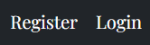  

        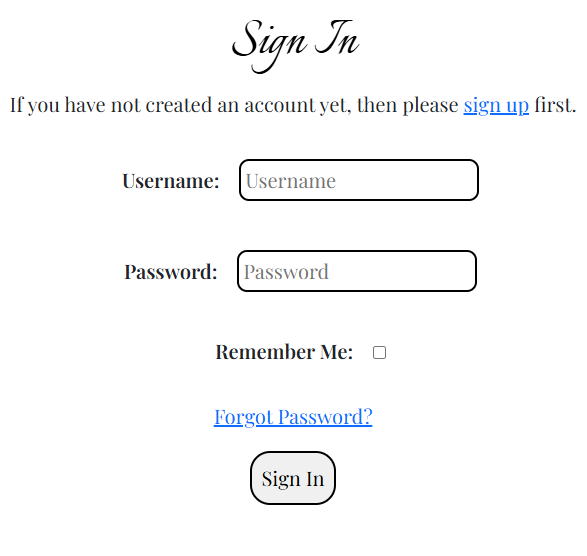
        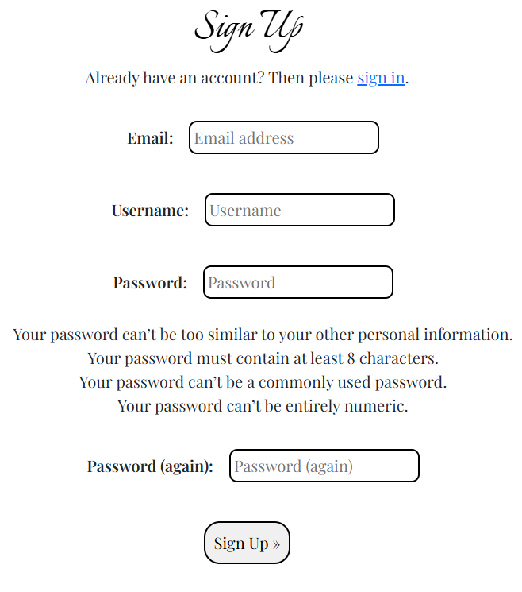  

        - Second you will receive an Email for confirmation.
            - This second step is a good way to avoid spam.
            - Email is set up with a Gmail account `Nestbite@gmail.com` created for the project purpose only.
            - Settings using backend mail and Heroku keys/values(previously only in the env.py file).  
            - The actual code for the settings was provided/learned from :Diploma in Full Stack Software Development learning path.  
            - Once you are registered/logged in you can see the logout and profile buttons.  
            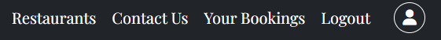  
            - Nestbite Email  
            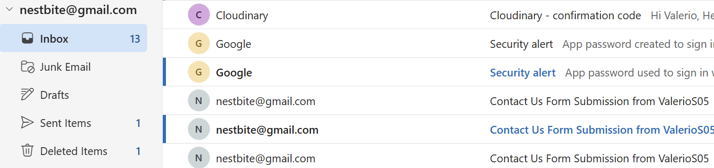

    - Epic 2 : Reservation System
        - This Epic covers stories related to reservation-related features (guest/owners/admin).
        - User Stories:
            - U.S. 2.1
            As a user, I want to search for available tables by date and time so I can choose a suitable one for me.

            - U.S. 2.2
            As a user , I want to receive confirmation so I can have proof of my reservation.

            - U.S. 2.3
            As a user, I want to be able to view/manage my reservation so I can cancel if I need to.

            - U.S. 2.4
            As a user, I want to be able to add notes to my reservation so I can leave special requests/needs

            - U.S. 2.5
            As a owner, I want to set available time slots and table so I can control the flow of people (no overbooking , no booking for same table)
        
            - U.S. 2.6
            As a owner , I want to be able to access reservations so I can view, modify or cancel.
        - Making a reservation/booking is one of the most crucial NestBite's features.
        Many things needs to be accounted for, as the user stories specify.
            - Date and time for the booking, simple at first look in the webpage, quite intricated at the back.
                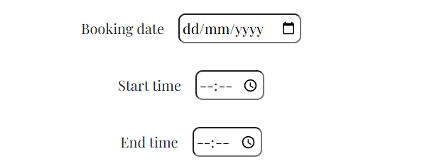  
            User can choose date and time using inputs as widgets. Many restrictions are added for example:
                - Working hours of the actual restaurant, already existing booking , date and times restrictions like, nothing can be booked in the past or in the too distant future.
                - There is a maximum stay(3hrs) and a minimum(1 hr) restriction.
                - Booking can be made/updated/canceled 2 hours in advance, this goes for real life situations where last minute changes are not very liked by anyone.  
                - The reservation system give also the chance to leave a message for the related booking for any special request or any other issue/request.
                - The system provide also feedbacks to the user, and it's quite many.
                    - Feedbacks for:
                        - Succesfull booking.
                        - Unsuccesfull: 
                            - Already existing bookings at that time/date for that table(s).
                            - Time/Date restrictions.
                            - Missing inputs
                    - I decided to also add a feedback to let the user know that there are tables available with similar prices / timing making easier the reselection.
                - Once the table(s) is booked the user will be able to see the booking saved in `Your Bookings` page.
                From there the user is able to delete/view/update the booking, obviously following the same restrictions as for the booking.

                |||
                |--|--|
                |  
                |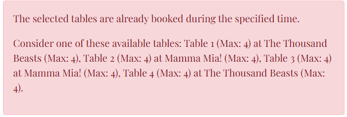  
                |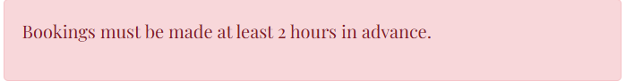  
                |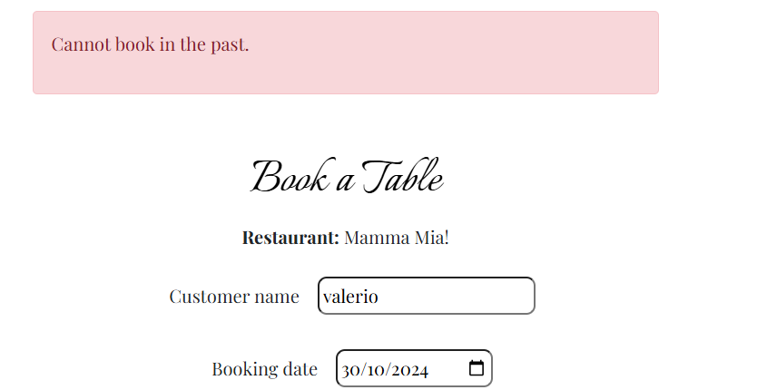  
                |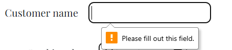
                |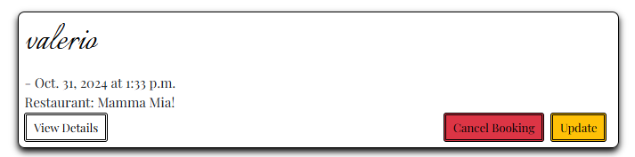
   
    - Epic 3 : Admin Panel
        - This Epic covers stories related to managing the admin panel(accounts ,approvals, settings..).
        - User Stories:
            - U.S. 3.1
                As an Admin, I want to be able to see and mofify registrations, so I can manage my users.

            - U.S 3.2
                As an Admin, I want to be able to see and manage my restaurants so I can ensure is up to date and best quality.

            - U.S 3.3
                As an admin, I want to be able to see the site settings so I can modify them if needed.
    - Epic 4 : UX/UI
        - This Epic covers stories related to UX and UI.
        - User Stories:

            - U.S. 4.1
            As user, I want the site to be mobile-friendly(mobile first) and responsive so that I can access it from any of my devices.

            - U.S 4.2
            As a user, I want the page to load quickly so I can smoothly make reservations.

            - U.S 4.3
            As a user, I want the site to be organized and easy to understand at first impact so I can use the site properly even if is the first time

            - U.S 4.4
            As a user, I want to filter options for restaurants to be easy to use so that I can find a restaurant with my preferences.

            - U.S 4.5
            As a user, I want forms inputs to give validations and feebacks so that I can correct mistakes before submitting.

            - U.S 4.6
            As a user, I want a contact page/button so that i can reach for support.

